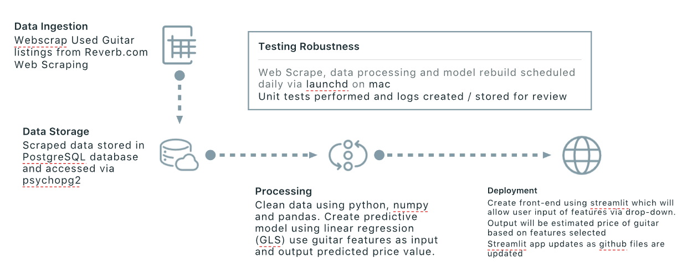
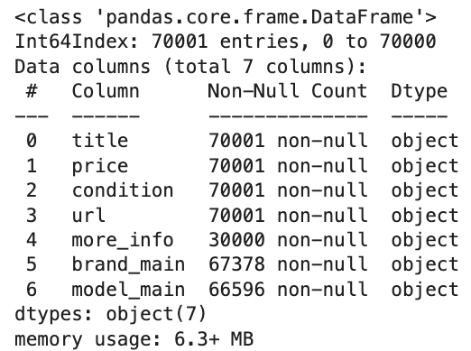
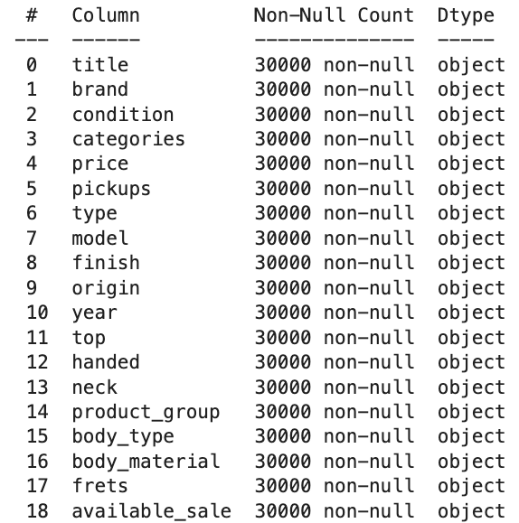
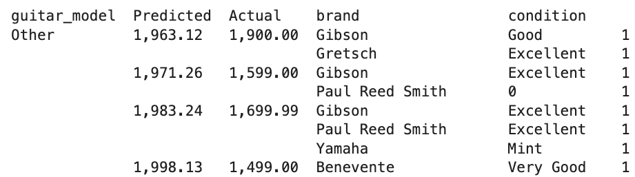
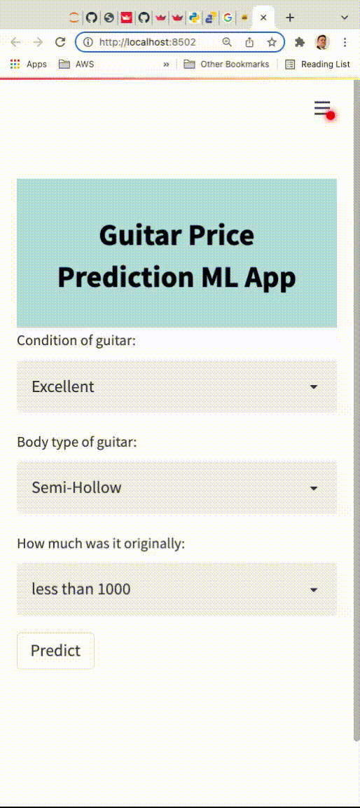

# Used Guitar Appraiser App using ML
### Data Engineering MVP 
----------------------
submitted by Mike Bernardo

## Introduction
---------------------

According to the Fender New Guitar Player Landscape Analysis survey, over the past 2 years 7% of Americans learned to play guitar- or roughly 16 million people aged 13-64.  With this increase of learners, sales for guitars new and used have also increased. 
The increase in demand coupled with the decrease in supply of guitars for these new players due to supply chain issues have also contributed to what guitar aficionados are referring to a ‘Guitar bubble’ in the same manner one would speak of the stock or housing market. 

The purpose of the project is to create a web application that will use machine learning algorithms to predict the value of a used electric guitar based on user input. 

## Design 

## Data
Data used for the project was scraped from Reverb.com. The web scrape process involved 2 steps:

<table>
    <tr>
        <td style="vertical-align:top"><h3>initial scrape to get all listings</h3> 
            
        </td>
        <td style="vertical-align:top"><h3>secondary scrape to get details for each guitar</h3> 
            
        </td>
    </tr>
    </table>
    
## Initial Results  
----------------------

The price predictions are realistic for mode known brands like Fender, Gibson however it needs work with lower priced and less known brands due to the lack of data. In some cases, a negative price prediction is given. This is an issue that will need more investigation.

 

<table>
        <tr><td style="vertical-align:top">
Using a Logistic Regression model to predict the 'price' of a used guitar, a web app was built 
deploy the model. 
            To use the app the user: 
        <ul>
          <li>selects the condition of the guitar</li>
          <li>selects the body type of the guitar</li>
          <li>selects the initial estimated original price of the guitar</li>
          <li>clicks 'predict'</li>
           <li>will see the estimated value current value of the guitar</li>
        </ul> 
              Although the model performance is not optimal yet, the initial pipeline is functional. The user can select features and a prediction is produced based on the model.
            </td>
            <td>
                 
            </td>
    </tr>
</table>
    
  
---------------------
## Further Work
---------------------
- Tuning of prediction model
- Additional input boxes will be added to allow the user to select brand, year and origin.
- Implementation of updates to grab recent listings and update the model for prediction
- Improved formatting and styling of the web app
- The web app will be deployed on Heroku
