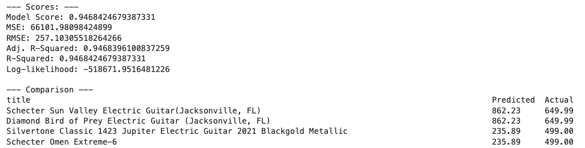

# Used Guitar Appraiser App using ML
### METIS Data Engineering Project
----------------------
submitted by Mike Bernardo

## Introduction
---------------------

According to the Fender New Guitar Player Landscape Analysis survey, over the past 2 years 7% of Americans learned to play guitar- or roughly 16 million people aged 13-64.  With this increase of learners, sales for guitars new and used have also increased. 
The increase in demand coupled with the decrease in supply of guitars for these new players due to supply chain issues have also contributed to what guitar aficionados are referring to a ‘Guitar bubble’ in the same manner one would speak of the stock or housing market. 

The purpose of the project is to create a web application that will use machine learning algorithms to predict the value of a used electric guitar based on user input. 

## Design 

## Data

<table style="width:800px; margin:5 auto;">
     <tr>Data used for the project was scraped from Reverb.com. The web scrape process involved 2 steps:</tr>
    <tr style="width:800px; margin:5 auto;">
        <td style="vertical-align:top"><h3>initial scrape to get all listings</h3> 
            
        </td>
        <td style="vertical-align:top"><h3>secondary scrape to get details for each guitar</h3> 
            
        </td>
    </tr>
</table>

    

## Tools:
 

    
| Data Ingestion | Data Processing | Data Storage | Deployment |
|---	|---	|---	|---	|
| Selenium  | Pandas | AWS S3 | Streamlit |
| BeautifulSoup | regex | boto 3 | github |
| Cron | AST | postgreSQL | AWS |
| papermill | DeepNote | psycopg2 | Streamlit CLOUD |

   

-------------------
## Algorithm: 
----------------------
- used Sklearn Linear Regression GLS for price prediction based on the following features:
    - body style
    - body type
    - country of origin
    - condition
    - estimated original price
    
- model scores and sample results:    
 

The price predictions are realistic for mode known brands like Fender, Gibson however it needs work with lower priced and less known brands due to the lack of data. In some cases, a negative price prediction is given. This is an issue that will need more investigation.

 

    

-------------------
## Deployment: 
----------------------

Using the Logistic Regression model to predict the 'price' of a used guitar, Streamlit was used to build the front-end.
- To use the app the user:
    - selects the body style of the guitar
    - selects the body type of the guitar
    - selects the condition of the guitar
    - selects the origin of the guitar
    - selects the initial estimated original price of the guitar
    - clicks 'Appraise my Guitar'
    - will see the estimated value current value of the guitar

 
 

    
-------------------
## Communication: 
----------------------
- Here is the [link](https://share.streamlit.io/emichaelbernardo/guitar_pricer/main/guitar_2.py) to the web app
- Comment or Collaborate ? [Contact me](mailto:emichaelbernardo@gmail.com)

